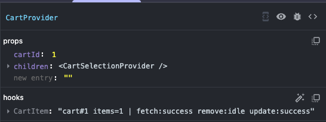

## useDebugValue

### 요약

- React DevTools에서 커스텀 훅에 라벨을 추가할 수 있게 해주는 훅
- React DevTools의 Component 탭에 들어가서 해당 커스텀 훅이 사용되는 컴포넌트의 hooks 탭에서 라벨을 확인 가능

사용법은 아래와 같음

`useDebugValue(value, format?)`
첫 번째 인자에는 디버깅할 값, 두 번째 인자는 선택으로 첫 번째 인자를 포맷팅시키는 함수

성능상의 이유로 format함수는 컴포넌트가 검사될 때만 실행된다.
컴포넌트가 검사된다는 말은 사용자가 React DevTools에서 해당 커스텀 훅이 사용되는 컴포넌트를 클릭 해 정보를 확인할 때를 말함

### 주요 용도

디버깅

### 예시

장바구니 미션에서 장바구니 id, 상품 수량, 비동기 함수들의 비동기 상태를 라벨링 해봤음

```tsx
useDebugValue(
  {
    cartId,
    itemCount:
      getCartItemsAsyncState.status === "success"
        ? getCartItemsAsyncState.data.length
        : null,
    fetch: getCartItemsAsyncState.status,
    remove: deleteCartItemAsyncTask.asyncState.status,
    updateCount: updateCartItemCountAsyncTask.asyncState.status,
  },
  ({ cartId, itemCount, fetch, remove, updateCount }) =>
    `cart#${cartId} items=${itemCount ?? "-"} | fetch:${fetch} remove:${remove} update:${updateCount}`,
);
```



### 느낀점

1. console.log 디버깅과의 차이점은?

- 콘솔 탭이 아니라 React DevTools로 디버깅을 할 수 있음.
- 따라서 타겟하는 컴포넌트의 정보와 그 컴포넌트가 사용하는 훅 내부의 상태값까지 관측 가능
